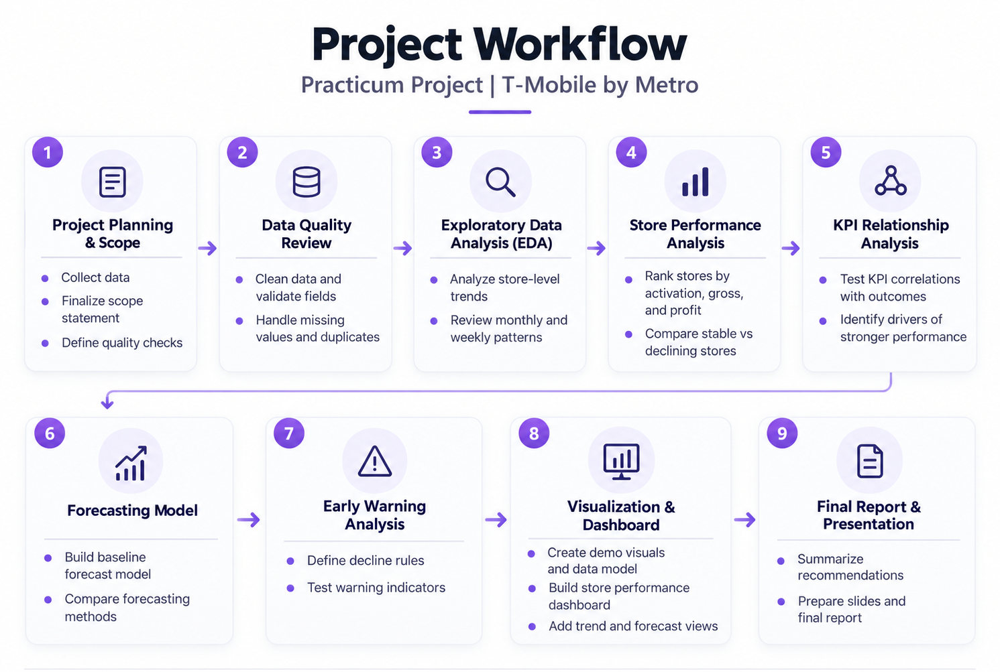
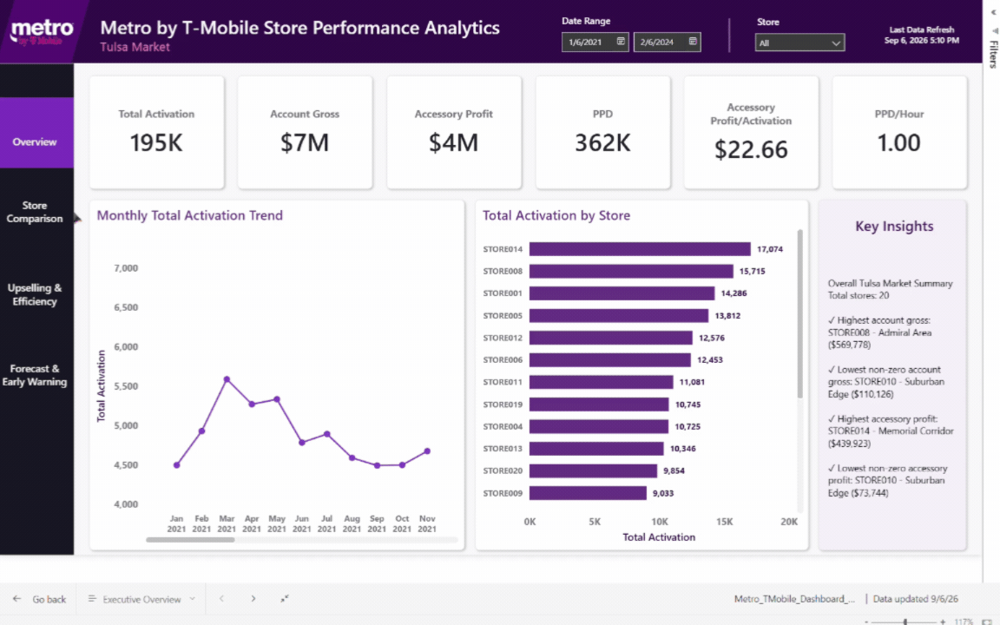
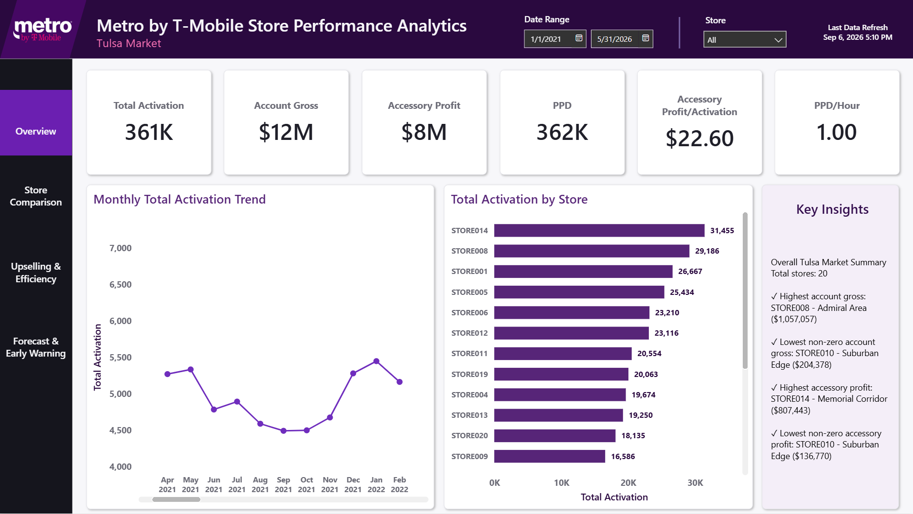
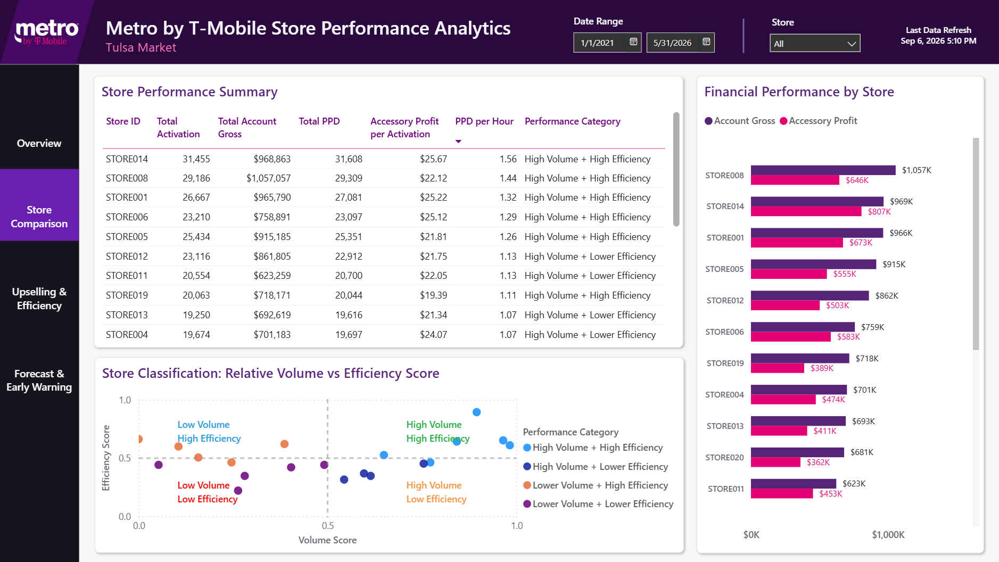
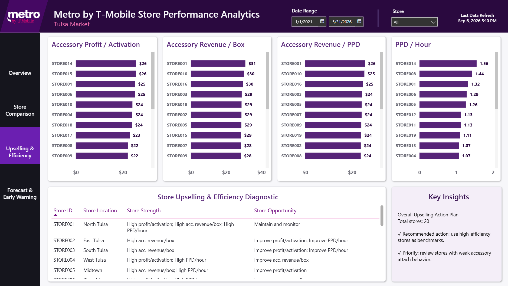
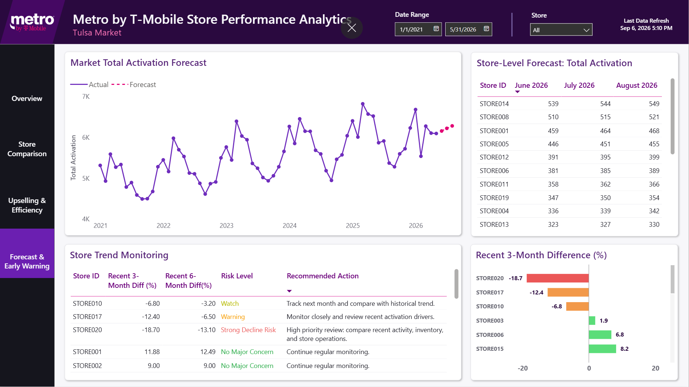

# Metro by T-Mobile Store Performance Analytics

This repository contains a public demo version of my practicum project for a retail store performance analytics case focused on Metro by T-Mobile stores in the Tulsa market.

The original practicum project used company-provided store performance data. Because the original data is confidential, this public GitHub version uses synthetic demo data that follows a similar structure. The goal of this version is to show the full analytics workflow: data cleaning, KPI analysis, store comparison, forecasting, early warning logic, and Power BI dashboarding.

---

## Project Purpose

The main goal of this project was to turn store-level performance reports into a cleaner analytics process that can help answer business questions such as:

- Which stores are leading the market, and which stores are falling behind?
- Are low-performing stores struggling because of lower activity volume, weaker accessory performance, lower productivity, or a mix of several factors?
- Which stores have strong sales volume but still show room for improvement in efficiency?
- How do activation, account gross, accessory profit, and productivity metrics vary across stores and over time?
- Which KPIs appear most closely associated with stronger store performance?
- Are there early signs that a store’s performance is declining before it becomes a bigger issue?
- How can store performance be summarized in a dashboard so managers can quickly identify where to focus?

---

## Important Note About Data

The data in this repository is synthetic and was created for public demonstration only.

The original company data is not included in this repository. Store names, values, and additional fields in the public dataset are for demonstration purposes and should not be interpreted as real company performance.

The early-warning examples are also demonstration outputs created to show how warning flags can appear in a dashboard.

---

## Project Workflow

The project followed a step-by-step analytics workflow.




---

## Tools Used

The following tools were used in this project:

- Python
- Pandas
- NumPy
- Matplotlib
- Scikit-learn
- XGBoost
- Prophet
- Statsmodels
- Power BI
- Excel
- GitHub
- Notion for project planning

---

## Project Management
This project was organized using a structured roadmap with epics and tasks, including project planning and scope, data quality review, exploratory data analysis, store performance analysis, KPI relationship analysis, forecasting models, early warning analysis, and visualization and dashboard.

The full project workflow and progress tracking are available in Notion:
[View the Data Warehouse Project Roadmap](https://statuesque-roar-fd7.notion.site/Practicum-Project-T-Mobile-by-Metro-37c4b0ee654e8048bb8ed078967b1634?source=copy_link)

---

# 🗃️ Datasets
This public version includes synthetic datasets only.


File name: demo_daily_sales_messy.csv

This file contains daily store-level demo data. It includes messy formatting similar to the actual data.

File name: demo_monthly_kpi_messy.csv

This file contains monthly store-level KPI data. It is used to support store comparison, KPI review, and dashboard preparation.

File name: kpi_dictionary.csv

This file explains the KPI abbreviations and metric names used in the project.

A more readable version is also included in: docs/kpi_dictionary.md

## Power BI Dashboard
The Power BI dashboard includes four main pages:
1. Overview
2. Store Comparison
3. Upselling & Efficiency
4. Forecast & Early Warning

Dashboard preview:



Dashboard screenshots:









The Power BI dashboard file is included here: dashboard/Metro_TMobile_Dashboard_Demo_Public.pbix

---

## How to Run This Project

1. Clone the repository
2. Open the project folder
   cd metro-tmobile-store-performance-analytics
3. Install the required Python libraries
   pip install -r requirements.txt
4. Run the notebooks in order
   01_data_cleaning_and_eda.ipynb
   02_kpi_framework_and_store_performance.ipynb
   03_upselling_efficiency_and_segmentation.ipynb
   04_forecasting_models.ipynb
   05_dashboard_data_preparation.ipynb

   The notebooks are located in the notebooks/ folder.
5. Open the Power BI dashboard
   dashboard/Metro_TMobile_Dashboard_Demo_Public.pbix

Some file paths may need to be adjusted depending on whether the project is run locally, in Google Colab, or on another machine.

---

## Limitations
This project has several important limitations:
- The public dataset is synthetic and does not show real company performance.
- The original company data is confidential and is not included in this repository.
- Store names, values, and some fields were created for demonstration purposes.
- The analysis uses store-level aggregated data, not customer-level data.
- KPI relationships should be interpreted as associations, not causal relationships.
- Forecasting outputs are planning estimates and should not be treated as exact predictions.
- The Power BI dashboard may require path updates after downloading the repository.

---

## Repository Structure

```text
metro-tmobile-store-performance-analytics/
│
├── README.md
├── requirements.txt
├── .gitignore
│
├── notebooks/
│   ├── 01_data_cleaning_and_eda.ipynb
│   ├── 02_kpi_framework_and_store_performance.ipynb
│   ├── 03_upselling_efficiency_and_segmentation.ipynb
│   ├── 04_forecasting_models.ipynb
│   └── 05_dashboard_data_preparation.ipynb
│
├── data/
│   └── raw/
│       ├── demo_daily_sales_messy.csv
│       ├── demo_monthly_kpi_messy.csv
│       └── kpi_dictionary.csv
│
├── dashboard/
│   ├── Metro_TMobile_Dashboard_Demo_Public.pbix
│   ├── dashboard_metro_by_tmobile.gif
│   └── screenshots/
│       ├── 01_overview.png
│       ├── 02_store_comparison.png
│       ├── 03_upselling_efficiency.png
│       └── 04_forecast_early_warning.png
│
└── docs/
    ├── kpi_dictionary.md
    ├── project_workflow.md
    └── project_workflow_infographic.png
